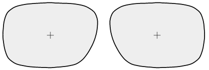

# LensProtocol

A Ruby parser and builder for the OMA protocol (a.k.a. Data Communication Standard) that was developed by the Lens Processing & Technology Division of The Vision Council for interconnection of optical laboratory equipment.

Furthermore, it allows you to generate a SVG representation of the tracing datasets.

[](https://travis-ci.org/eeng/lens_protocol)

## Installation

```ruby
gem 'lens_protocol'
```

## Usage

### Parsing an OMA file

```ruby
require 'lens_protocol'
message = LensProtocol::OMA.parse(File.read('examples/oma/R360_1.oma'))
message.values_of('SPH') # => [1.25, -0.5]
```

### Generating an OMA file
```ruby
message = LensProtocol::OMA.generate(
  'JOB' => 42,
  'SPH' => [1.25, -0.5]
)
puts message
# =>
# JOB=42
# SPH=1.25;-0.50
```

### Generating the Tracing SVG

The `message.to_svg` method returns an array of SVG strings, one for each side, which can be used directly in an ERB template, like this:

```html
<div class="lenses-container">
  <% message.to_svg.map do |svg| %>
    <div class="lens">
      <%= svg %>
    </div>
  <% end %>
</div>
```

And it should look like this:



To customize the styles, please check out [the provided sample stylesheet](examples/public/styles.css).

## Development

After checking out the repo, run `bin/setup` to install dependencies. Then, run `rake spec` or `guard` to run the tests. You can also run `bin/console` for an interactive prompt that will allow you to experiment.

There's also a Sinatra app which allows you visualize the generated SVG. To start the server do `bundle exec ruby examples/svg.rb` and go to `http://localhost:4567/`

To install this gem onto your local machine, run `bundle exec rake install`. To release a new version, update the version number in `version.rb`, and then run `bundle exec rake release`, which will create a git tag for the version, push git commits and tags, and push the `.gem` file to [rubygems.org](https://rubygems.org).

## Contributing

Bug reports and pull requests are welcome on GitHub at https://github.com/eeng/lens_protocol. This project is intended to be a safe, welcoming space for collaboration, and contributors are expected to adhere to the [Contributor Covenant](http://contributor-covenant.org) code of conduct.

## Code of Conduct

Everyone interacting in the LensProtocol project’s codebases, issue trackers, chat rooms and mailing lists is expected to follow the [code of conduct](https://github.com/eeng/lens_protocol/blob/master/CODE_OF_CONDUCT.md).
